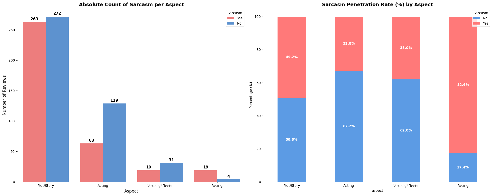
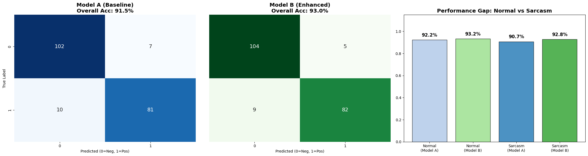
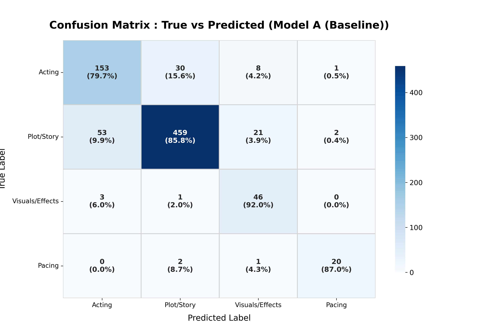
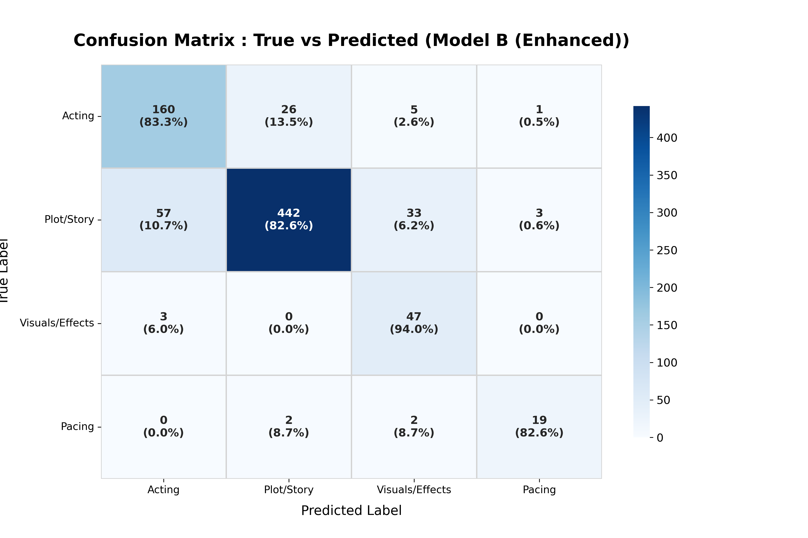

# 🎭 Impact of Sarcasm Feature Injection on SetFit Models

> **Does explicitly telling a model "This is sarcasm" help it understand sentiment better?**
>
> 本專案使用 **SetFit (Efficient Few-Shot Learning)** 框架，結合 **LLM 自動標註技術**，探討「反諷特徵注入」對情感分析與評論分類的影響。

## 📖 Project Overview (專案背景)

在自然語言處理 (NLP) 中，**反諷 (Sarcasm)** 往往是模型誤判的主要原因。使用者常使用正面的字眼表達負面的情緒（例如：*"Great job ruining the movie"*），這導致模型容易產生 False Positive 的誤判。

本實驗核心目標：**利用 GenAI 標註出的反諷特徵，能否幫助小模型 (SetFit/MPNet) 修正語意理解錯誤？**

---

## 📂 Dataset & Labeling Pipeline (資料集與標註流程)

由於原始的 IMDB 資料集僅包含 `text` 與 `sentiment`，缺乏細顆粒度的標籤，我們採用了 **LLM 輔助標註 (LLM-Assisted Labeling)** 的方法來建構實驗資料。

### 1. Data Generation (Qwen Annotation)
我們使用 **Qwen (千問)** 大型語言模型作為標註器，針對原始評論進行特徵提取：
* **Source:** 原始 IMDB 影評資料。
* **Annotator Model:** `Qwen/Qwen2.5-1.5B-Instruct` (Local Inference).
* **Schema:**
    * `Aspect`: 評論關注點 (Acting, Plot, Visuals, Pacing)。
    * `Sarcasm`: 是否包含反諷語氣 (Yes/No)。

### 2. Data Distribution (資料分佈)
在進行模型訓練前，我們先分析了標註後的資料分佈。如下圖所示，資料集中包含了一定比例的反諷樣本，這為我們的 A/B Testing 提供了充足的實驗基礎。


*(上圖：原始訓練資料中的反諷 (Sarcasm) 與非反諷 (Normal) 樣本分佈情況)*

---

## 🧪 Experiment Design (實驗設計)

我們設計了兩組模型進行對照實驗 (A/B Testing)。

### Models
* **🔵 Model A (Baseline):**
    * **Input:** 原始評論文字 (Raw Text)
    * **Architecture:** `sentence-transformers/paraphrase-mpnet-base-v2`
* **🟢 Model B (Enhanced):**
    * **Input:** **注入標籤後的文字** (Sarcasm-Aware Text)
    * **Mechanism:** 模擬真實 Pipeline 情境。當偵測到反諷時，動態在句首注入 `[Sarcasm]` 標籤 (e.g., `[Sarcasm] Great job ruining the movie`)。

---

## 📊 Results & Visualization (實驗結果)

### 1. Sentiment Analysis: Robustness on Edge Cases
**結論：整體準確率持平，但成功修復了高難度的語意陷阱。**

實驗數據顯示，Baseline (Model A) 與 Enhanced (Model B) 在整體準確率上差異不大。這反映了現今預訓練模型 (如 MPNet) 本身已具備強大的語境理解能力，能自行處理大部分的反諷語句。

然而，在少數極端案例中 (Hard Cases)，Model B 展現了其價值：
* **Performance:** 兩者在一般句與反諷句的總體表現相近。
* **Correction:** Model B 成功修正了那些「混合大量正面詞彙、結構極度隱晦」的深層反諷句，證明了標籤能作為最後一道防線。



### 2. Aspect Classification: The Trade-off
**結論：反諷標籤對「演技」有幫助，但對「劇情」造成干擾。**

在面向分類任務中，我們發現了有趣的權衡現象 (Trade-off)：
* **Acting (演技):** 準確率提升。因為對演技的批評常帶有強烈的情緒語氣，反諷標籤強化了這一點。
* **Plot (劇情):** 準確率微幅下降。推測是因為 `[Sarcasm]` 標籤改變了句子的語意焦點，導致模型忽略了後續對劇情內容的長篇描述。

| Model A (Baseline) | Model B (Enhanced) |
| :---: | :---: |
|  |  |

---

## 💡 Key Insights (關鍵洞察)

1.  **The "Ceiling Effect" of Modern LLMs:**
    實驗發現，像 `paraphrase-mpnet-base-v2` 這樣強大的預訓練模型，本身對反諷的捕捉能力已經非常高（Baseline 在反諷句上的準確率並未崩盤）。這意味著 Feature Injection (特徵注入) 在現代 NLP 中，更多是扮演 **「微調 (Fine-tuning)」** 或 **「除錯 (Debugging)」** 的角色，而非雪中送炭。

2.  **Sarcasm Tagging for "Hard Cases":**
    雖然量化數據上的提升有限，但質化分析 (Qualitative Analysis) 顯示，注入標籤能有效幫助模型處理 **「語意極度衝突」** 的句子。例如，當評論者用極其華麗的詞藻讚美軍人來貶低戰爭電影時，Baseline 容易被正面詞彙迷惑，而 Enhanced 模型則能保持清醒。

3.  **Rescued Cases (成功救援案例分析):**
    在測試集中，我們捕捉到了 Model B 成功修正 Model A 誤判的珍貴案例：
    
    > **Case 509:** *"I thought it was a New-York located movie: wrong! ... Another positive side ... fine acting..."*
    > * **Model A:** Positive ❌ (被 `fine acting`, `positive side` 誤導)
    > * **Model B:** Negative ✅ (因 `[Sarcasm]` 標籤而正確識別出抱怨語氣)

    > **Case 725:** *"I'm both amused and disgusted... The fine Americans... deserve our respect..."*
    > * **Model A:** Positive ❌ (被 `respect`, `fine Americans` 誤導)
    > * **Model B:** Negative ✅ (標籤提示模型這是一段帶有嘲諷意味的比較)

---

## 📂 Project Structure

```text
Sarcasm-Enhanced-SetFit/
├── data/
│   └── qwen_labeled_data.csv        # Annotated by Qwen LLM
├── notebooks/
│   ├── 01_Model_Training.ipynb      # SetFit training pipeline
│   └── 02_Evaluation_Analysis.ipynb # Visualization & A/B testing logic
├── results/
│   ├── aspect_confusion_matrix_A.png
│   ├── aspect_confusion_matrix_B.png
│   ├── sarcasm_analysis_bar.png         # Data distribution chart
│   └── sentiment_confusion_matrix_comparison.png
└── requirements.txt
```

---

## 🛠️ Tech Stack


* **Data Labeling (LLM):** `Qwen/Qwen2.5-1.5B-Instruct`
* **NLP Framework:** [SetFit](https://github.com/huggingface/setfit) (Hugging Face)
* **Pre-trained Model:** `sentence-transformers/paraphrase-mpnet-base-v2`
* **Analysis Tools:** `pandas`, `scikit-learn`, `seaborn`, `matplotlib`
* **Environment:** Google Colab (T4 GPU)

---

## 👤 作者 (Author)
**王譽鈞 (YuJunWang)**
* Data Engineer / Data Scientist / AI-Augmented Developer 
* [GitHub Profile](https://github.com/YuJunWang)